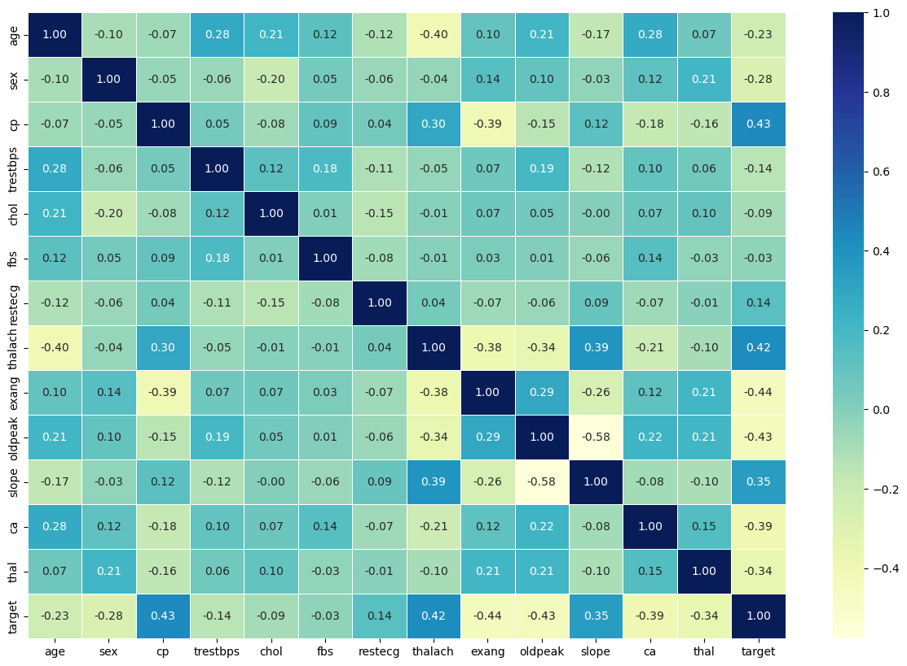
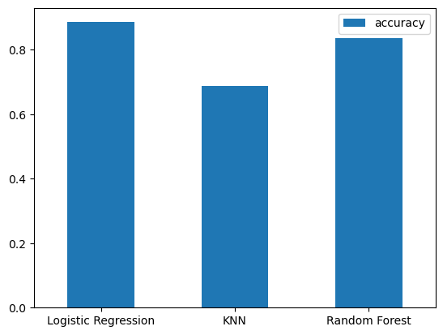
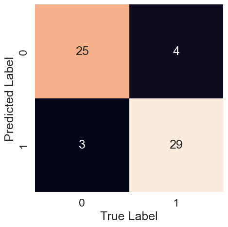
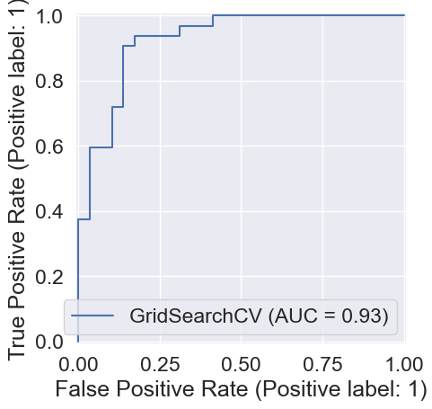
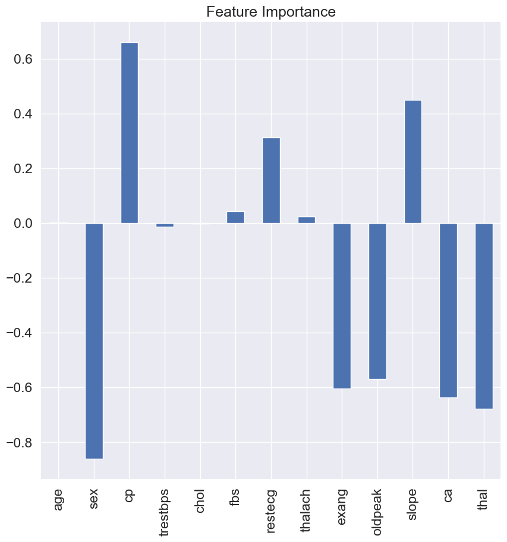
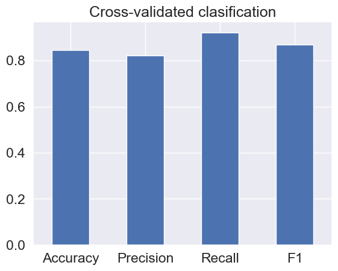

# Heart Disease Classification
This repository contains a `binary classification` project that uses various python based machine learning and data science libraries to build a machine learning model capable to a high degree of accuracy of predicting whether or not a person has heart disease, based on given clinical parameters or features. 

### Project Overview
Heart Disease is dangerous and the earlier it is spotted the better. This project aims at assisting medical professionals, students and patients themselves be able to classify a heart disease case with a great degree of accuracy so that the necessary precautions can be taken. 

- **Exploratory Data Analysis**: Which involves going through the data using statistical tools like histogram, bargraphs, piecharts and so on. The dataset's columns and it's rows are scrutinized, checking for missing data, correlation, relationships and patterns. It also involves understaning the data and getting subject expert knowledge so that the problem can be solved as best as possible.

**Correlation Matrix**

A correlation matrix helps understand relationships between numerical features. The values range from `-1` to `+1`, with `-1` meaning perfect negative correlation, `0` meaning no Linear relationship and `+1` meaning perfect positive correlation.
It helps picture how well our `target column` (Heart Disease) relates with the other columns and how much each may contribute to the final decision. `cp`, `thalach` and `slope` had the higher correlation with our target column with values of `0.43`, `0.43` and `0.35` respectively. 



- **Filling Missing Data**: This is a crucial part of the model creation purpose, Models cannot thoroughly learn from Nan values. The method of filling is crucial. Mode was used for non-numerical values and 

- **Modelling and Model Evaluation**: This section involving applying machine learning models to our already clean dataset. In this project Ensemble's Random Forest Classifier, Logistic Regression and KNN were both evaluated and tuned to find which found more pattern and learned better on the data. `Logistic Regression` excelled above the others learned better in finding patterns and produced a baseline accuracy score of `88.52%`.

**Model Accuracies**



**Confusion Matrix**

A confusion matrix gives a breakdown of correct and incorrect classsifications for each category. It tells how ad where the model is misclassifying and if a class is over- or under-predicted.




**ROC Curve and AUC score**

ROC(Receiver Operating Charactersistic) curve shows the trade-off between sensitivity (true positive rate) and specificity (1 - false positive rate). While the AUC (Area Under Curve) score summarises the ROC, with a score closer to 1 meaning a better model. They both help to tell us how imbalanced classes affect our model. It had an `AUC score` of `0.93`




**Feature Importance of Columns on Ensemble Model**

Feature importances shows how much each column contributed to the final prediction.




**Cross-Validation Evaluation**

Cross validation is applied to Accuracy, Precision, Recall and F1-score to show how much our model actually learns from our data by sampling it different ways and training and testing.




### Installation
1. **Clone The Repository**
	```bash
	git clonehttps://github.com/Darc-lord/Heart-Disease-Classification.git
	cd Heart-Disease-Classification
	```

2. **Download Dataset**
	```bash
	 https://doi.org/10.33484/sinopfbd.1445215
	```	

## Acknoledgements
+ Kaggle
+ Scikit-learn
